# 任务

添加注册中心eureka，选择服务添加网关zuul

# 完成结果

SpringBoot版本：1.5.22.RELEASE	SpringCloud版本：Edgware.SR6

备注：

1. 未添加zuul插件

2. 所有添加的服务均写好Dockerfile，以及在根目录docker-compose.yml增加对应任务

## 添加Eureka

服务名：ts-eureka-registry

eureka版本：1.4.7.RELEASE

备注：保留了ConfController，正常运行

## 添加网关Zuul

zuul版本：2.2.5.RELEASE，与整个项目SpringCloud版本不同，但没影响

### 所选服务

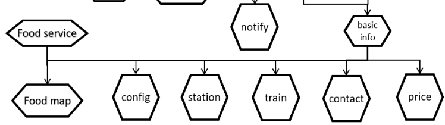

ts-basic-sevice

ts-train-service

ts-station-service

ts-price-service

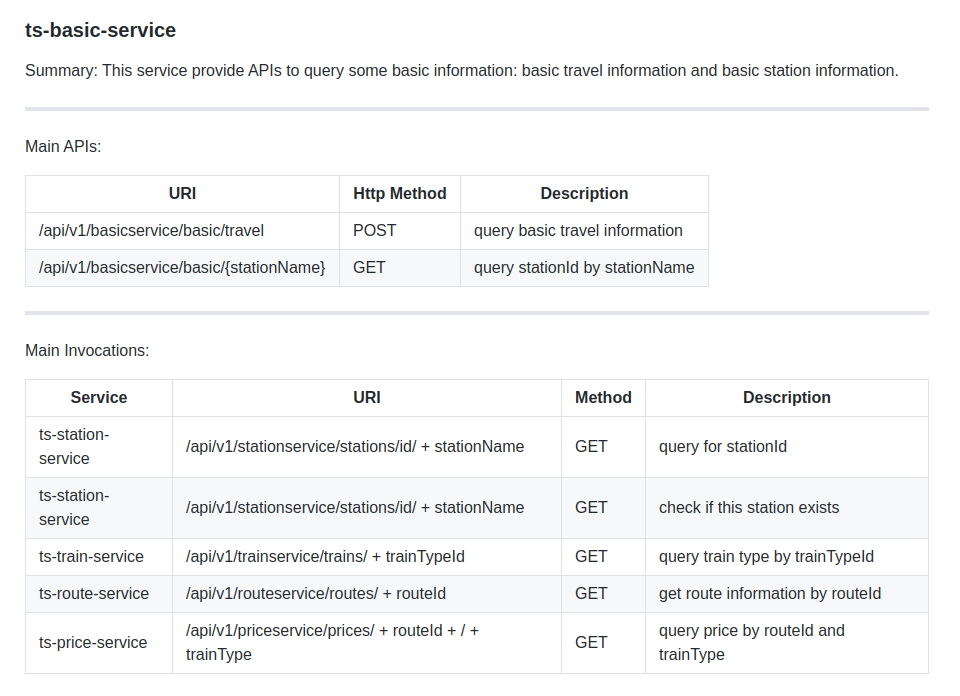

### 完成效果

### 添加过程

#### 给basic-station添加网关

1. 多实例：ts-station-service(端口12345)，ts-station2-service(端口16345)
2. 添加网关：ts-zuul-station(端口30001)
3. 路由配置：

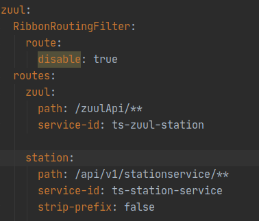

4. ts-basic-service修改

   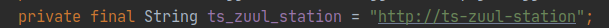

   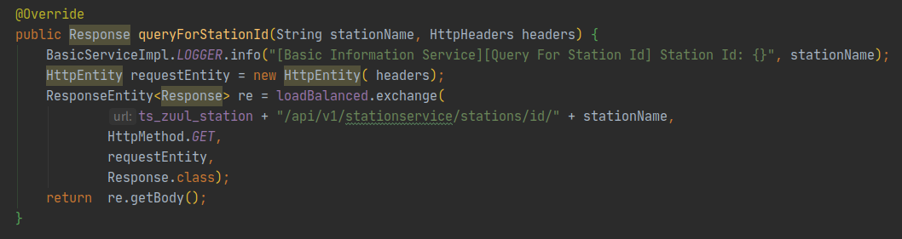

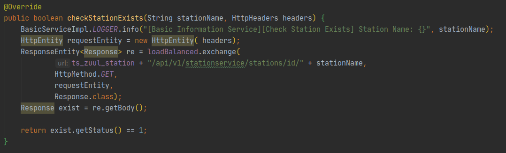

#### 给basic-train添加网关

1. 多实例：ts-train-service(端口14567)，ts-train2-service(端口16567)

2. 添加网关：ts-zuul-train(端口30002)

3. 路由配置：

   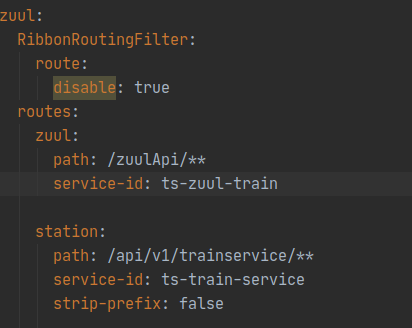

4. ts-basic-service修改

   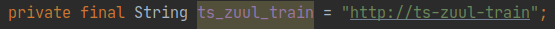

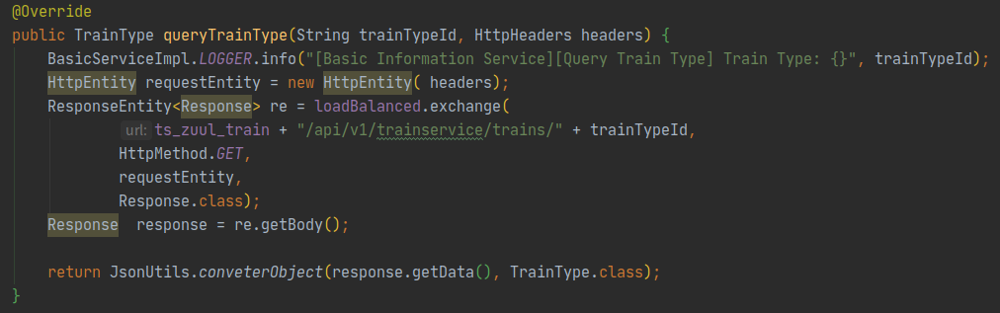

#### 给basic-price添加网关

1. 多实例：ts-price-service(端口16579)，ts-price2-service(端口18579)
2. 添加网关：ts-zuul-price(端口30003)
3. 路由配置：

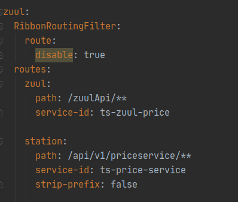

4. ts-basic-service修改

   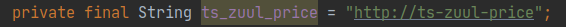

   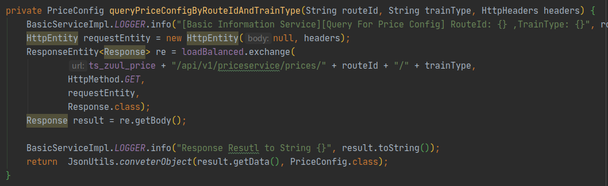

### 测试

由于增加了7个服务，本地16G内存跑不起来，所以没有实际整个项目测试

采用的测试方法是模拟两个服务——调用服务和被调用服务

调用服务：ts-resttemplate

被调用服务：ts-zuul 

测试全部通过，能通过网关正常进行转发